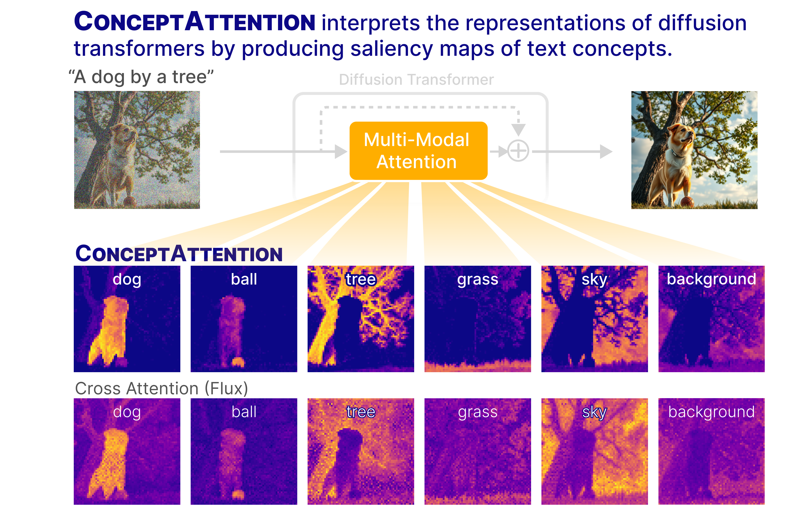

[](https://huggingface.co/spaces/helblazer811/ConceptAttention)
[](https://arxiv.org/abs/2502.04320)

ConceptAttention is an interpretability method for multi-modal diffusion transformers. We implement it for the Flux DiT architecture in PyTorch. 

<p align="center">
    
</p>

# Code setup

You will then need to install the code here locally by running
```bash
    pip install -e .
```

# Running the model 

Here is an example of how to run Flux with Concept Attention

```python
from concept_attention import ConceptAttentionFluxPipeline

pipeline = ConceptAttentionFluxPipeline(
    model_name="flux-schnell",
    device="cuda:0"
)

prompt = "A dragon standing on a rock. "
concepts = ["dragon", "rock", "sky", "cloud"]

pipeline_output = pipeline.generate_image(
    prompt=prompt,
    concepts=concepts,
    width=1024,
    height=1024,
)

image = pipeline_output.image
concept_heatmaps = pipeline_output.concept_heatmaps

image.save("image.png")
for concept, concept_heatmap in zip(concepts, concept_heatmaps):
    concept_heatmap.save(f"{concept}.png")
```

# Experiments

Each of our experiments are in separate directories in `experiments`. 

You can run one for example like this
```bash
   cd experiments/qualitative_baseline_comparison
   python generate_image.py # Generates test image using flux
   python plot_flux_concept_attention.py # Generates concept attention maps and saves them in results. 
```

# Data Setup
To use ImageNetSegmentation you will need to download `gtsegs_ijcv.mat` into `experiments/imagenet_segmentation/data`. 

```bash
    cd experiments/imagenet_segmentation/data
    wget http://calvin-vision.net/bigstuff/proj-imagenet/data/gtsegs_ijcv.mat
```


# Bibtex

```
    Bibtex goes here. 
```